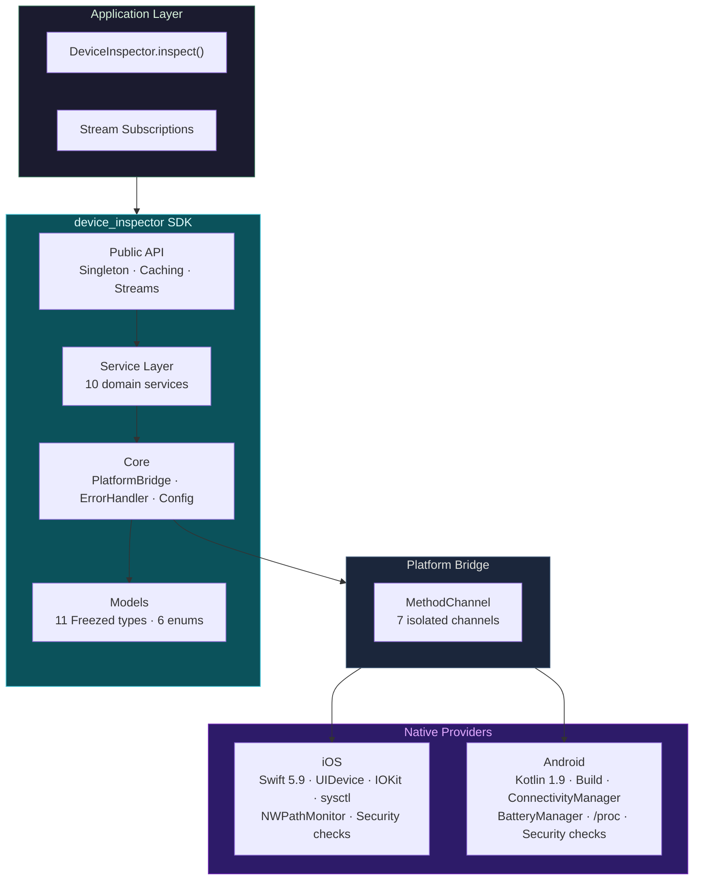

<h1 align="center">device_inspector</h1>

<p align="center">
  <strong>Production-grade device intelligence SDK for Flutter</strong><br/>
  <em>Comprehensive hardware, system, network, and security telemetry — through a single, consistent API.</em>
</p>

<p align="center">
  <a href="https://pub.dev/packages/device_inspector"></a>
  <a href="https://github.com/ykarateke/device_inspector/actions"></a>
  <a href=""></a>
  <a href="https://opensource.org/licenses/MIT"></a>
</p>

<p align="center">
  iOS 14+ &nbsp;·&nbsp; Android 7.0+ &nbsp;·&nbsp; Swift 5.9 &nbsp;·&nbsp; Kotlin 1.9 &nbsp;·&nbsp; Dart 3.4+
</p>

---

## Overview

Modern Flutter applications depend on accurate device context for crash diagnostics, performance profiling, security auditing, and business intelligence. The Flutter ecosystem fragments this data across multiple packages — `device_info_plus`, `battery_plus`, `connectivity_plus`, `network_info_plus` — each with its own API surface, error handling, and maintenance lifecycle.

**device_inspector** consolidates all device telemetry into a single, well-typed, extensively tested SDK. It replaces the fragmented package landscape with one `inspect()` call that returns a complete, immutable device snapshot.

```dart
final snapshot = await DeviceInspector.inspect();
// DeviceSnapshot{
//   device:     iPhone 15 Pro | tier: high
//   os:         iOS 17.4
//   battery:    85% charging
//   network:    WiFi | VPN: false
//   security:   score 100/100 | not compromised
//   memory:     3.2 GB available of 8.0 GB
//   storage:    120 GB free of 256 GB
//   fingerprint: d4e5f6a7b8c9...
// }
```

---

## Architecture



---

## Capabilities

### Device Identity

```
manufacturer    "Apple"             model           "iPhone16,2"
marketName      "iPhone 15 Pro"     codename        "D84AP"
tier            high                releaseYear     2023
```

### Operating System

```
platform        iOS                 version         17.4
majorVersion    17                  minorVersion    4
buildNumber     21E236              kernelVersion   Darwin 23.4.0
apiLevel        null (iOS)          34 (Android)
```

### Battery & Power

```
level           85                  chargingState   discharging
isCharging      false               health          good
maxCapacity     95%                 lowPowerMode    false
```

### Network & Connectivity

```
type            wifi                carrier         Turkcell
generation      5G                  vpn             false
proxy           false               airplaneMode    false
signalStrength  4
```

### Hardware Specifications

**CPU** — A17 Pro · 6 cores (4P+2E) · arm64 · 3.78 GHz · Neural Engine

**GPU** — Apple A17 GPU · Metal 3 · MTLGPUFamilyApple9

**Display** — 1179 × 2556 px · 3.0× density · 120 Hz · HDR

### Memory & Storage

```
Memory:   3.2 GB available / 8.0 GB total (60.0% used)
Storage:  120 GB free / 256 GB total (53.1% used)
```

### Security Posture

| Check | Result |
|---|---|
| Root / Jailbreak | Not detected |
| Emulator | Not detected |
| Debugger | Not attached |
| Suspicious applications | None found |
| Suspicious file paths | None found |
| Dynamic library injection | Not detected |
| **Security Score** | **100 / 100** |

---

## Real-Time Monitoring

Battery and network state are available as broadcast streams. The SDK polls at configurable intervals and emits only when values change, minimizing overhead.

```dart
await DeviceInspector.initialize(const DeviceInspectorConfig(
  enableBatteryStream: true,
  enableNetworkStream: true,
  streamPollingIntervalMs: 3000, // poll every 3 seconds
));

DeviceInspector.batteryStream?.listen((battery) {
  if (battery.level < 20 && !battery.isCharging) {
    showLowBatteryWarning();
  }
});

DeviceInspector.networkStream?.listen((network) {
  if (network.isVpn) authenticateSession();
});
```

---

## Device Fingerprint

Produces a deterministic, anonymous SHA-256 hash from non-PII device characteristics — model, manufacturer, OS version, CPU architecture — combined with a locally stored random salt. The resulting 64-character hexadecimal string is:

- **Stable** across application restarts on the same device
- **Anonymous** — contains no IMEI, serial number, advertising ID, or personal data
- **Isolated** — different applications generate different fingerprints due to the per-app salt

```dart
final fingerprint = await DeviceInspector.fingerprint;
// d4e5f6a7b8c9d0e1f2a3b4c5d6e7f8a9b0c1d2e3f4a5b6c7d8e9f0a1b2c3d4
```

---

## Enterprise Integration

### Crash Reporting

```dart
// Sentry
final snapshot = await DeviceInspector.inspect();
Sentry.configureScope((scope) {
  scope.setContexts('device', snapshot.toJson());
  scope.setTag('device_tier', snapshot.device.tier.name);
  scope.setTag('security_score', '${snapshot.security.securityScore}');
});

// Firebase Crashlytics
await FirebaseCrashlytics.instance.setCustomKeys({
  'device_model': snapshot.device.model,
  'os_version': snapshot.os.version,
  'device_tier': snapshot.device.tier.name,
  'battery_level': snapshot.battery.level,
  'network_type': snapshot.network.type.name,
});
```

### Security Auditing

```dart
final security = await DeviceInspector.security;

if (security.isCompromised) {
  await api.reportSecurityEvent(SecurityEvent(
    threats: security.detectedThreats,
    score: security.securityScore,
    deviceFingerprint: await DeviceInspector.fingerprint,
  ));

  if (security.isRooted || security.isJailbroken) {
    restrictSensitiveOperations();
  }
}
```

### Device Tier Targeting

```dart
final tier = (await DeviceInspector.hardware).tier;

switch (tier) {
  case DeviceTier.low:
    applyMinimalGraphics();
    reduceAssetResolution();
  case DeviceTier.medium:
    applyStandardGraphics();
  case DeviceTier.high:
    applyUltraGraphics();
    enableRayTracing();
}
```

---

## Privacy & Compliance

device_inspector is designed for environments where data privacy is non-negotiable. The SDK operates entirely on-device with no network transmission capability.

**Collected (local-only, no transmission):**
- Device model, manufacturer, OS version
- CPU architecture, core count
- Battery level, charging state
- Network connection type
- Application version metadata

**Never collected:**
- IMEI, serial number, MAC address
- Phone number, contact lists
- GPS location
- Advertising identifiers (IDFA, AAID)
- Installed application lists
- Microphone, camera, or sensor data

**Compliance considerations:**
- GDPR: No personal data collected; falls under legitimate interest for diagnostics
- Apple App Store: Uses only public APIs (`UIDevice`, `sysctl`, `IOKit`)
- Google Play Store: No special permissions required beyond `ACCESS_NETWORK_STATE`
- No data leaves the device unless the integrating application explicitly serializes and transmits `toJson()` output, which is the developer's responsibility to declare in their privacy policy

---

## Platform Support

| Platform | Minimum Version | Status |
|---|---|---|
| iOS | 14.0 | Production |
| Android | 7.0 (API 24) | Production |
| Web | — | Not supported |
| macOS | — | Not supported |
| Windows | — | Not supported |
| Linux | — | Not supported |

---

## Data Model

```
DeviceSnapshot
├── device        DeviceInfo         manufacturer, model, marketName, tier
├── os            OSInfo             platform, version, major/minor/patch
├── battery       BatteryInfo        level, chargingState, health, lowPowerMode
├── network       NetworkInfo        type, carrier, isVpn, isProxy, signalStrength
├── hardware      HardwareInfo
│   ├── cpu       CPUInfo            name, cores, architecture, frequency, neuralEngine
│   ├── gpu       GPUInfo            name, metalSupport, vulkanSupport, openGLES
│   └── display   DisplayInfo        resolution, density, refreshRate, hdr, brightness
├── memory        MemoryInfo         totalBytes, availableBytes, usagePercent
├── storage       StorageInfo        totalBytes, freeBytes, usagePercent
├── security      SecurityInfo       isCompromised, detectedThreats, securityScore
├── app           AppInfo            appName, version, buildNumber, bundleId
└── timestampMsSinceEpoch
```

---

## Roadmap

| Version | Quarter | Scope |
|---|---|---|
| **0.1.0** | Q1 2025 | Device, OS, Battery, Network, App identity; Stream listeners; Fingerprint |
| **0.2.0** | Q2 2025 | Hardware intelligence: CPU, GPU, Display, Memory, Storage; Device tier classification |
| **0.3.0** | Q3 2025 | Security module: Root, Jailbreak, Emulator, Debugger detection; Threat scoring |
| **1.0.0** | Q4 2025 | Performance monitoring: FPS, CPU %, Memory, Thermal state; Stream-based telemetry |
| **2.0.0** | TBD | Cloud dashboard; Device fleet analytics; Crash correlation engine |

---

## Documentation

| Document | Contents |
|---|---|
| [API Reference](docs/API_SPEC.md) | Classes, methods, parameters, enums, error codes |
| [Architecture](docs/ARCHITECTURE.md) | Layered design, data flow, design decisions, performance |
| [Data Models](docs/DATA_MODELS.md) | 11 Freezed types, JSON serialization, model relationship tree |
| [Platform Integration](docs/PLATFORM_INTEGRATION.md) | iOS Swift + Android Kotlin native provider implementations |
| [Security & Privacy](docs/SECURITY_PRIVACY.md) | Detection algorithms, OWASP MASVS mapping, compliance |
| [Testing](docs/TESTING.md) | Test strategy, unit/service/integration suite, CI pipeline |
| [Development](docs/DEVELOPMENT.md) | Environment setup, conventions, module authoring, debugging |
| [Changelog](CHANGELOG.md) | Release history, migration notes, breaking changes |

---

## Development

```bash
git clone https://github.com/ykarateke/device_inspector.git
cd device_inspector
flutter pub get
dart run build_runner build --delete-conflicting-outputs

flutter test         # 96 tests, all passing
dart analyze         # 0 errors, 0 warnings
```

## License

MIT © [ykarateke](https://github.com/ykarateke)
