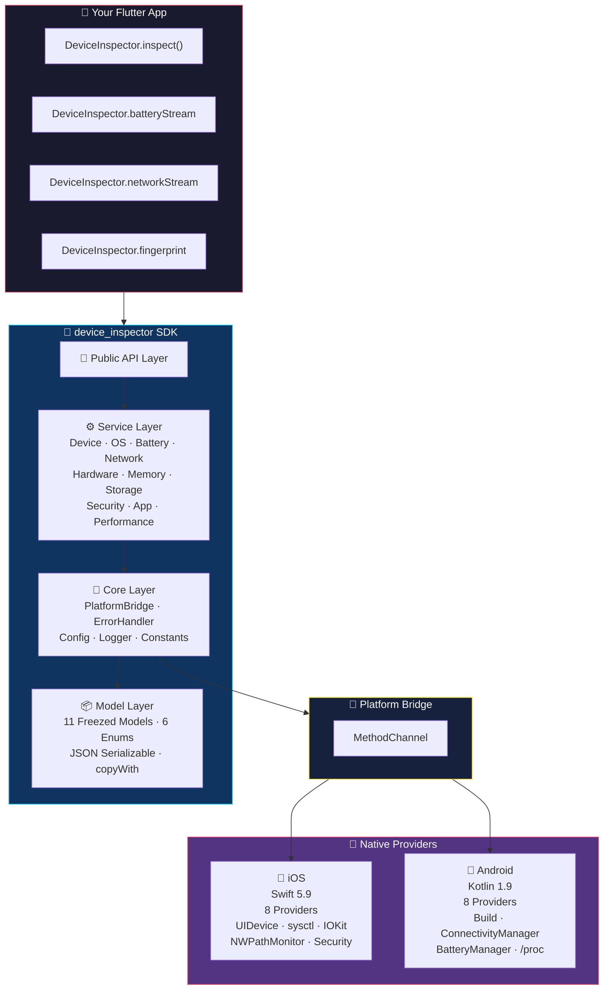

<p align="center">
  <picture>
    <source media="(prefers-color-scheme: dark)" srcset="https://raw.githubusercontent.com/ykarateke/device_inspector/main/assets/logo-dark.svg">
    
  </picture>
</p>

<h1 align="center">device_inspector</h1>

<p align="center">
  <strong>The missing device intelligence layer for Flutter</strong><br/>
  <em>One API. Everything about the device. Zero external dependencies.</em>
</p>

<p align="center">
  <a href="https://pub.dev/packages/device_inspector"></a>
  <a href="https://github.com/ykarateke/device_inspector/actions"></a>
  <a href=""></a>
  <a href="https://opensource.org/licenses/MIT"></a>
</p>

<p align="center">
  <sub>
    🍎 <b>iOS 14+</b> &nbsp;│&nbsp;
    🤖 <b>Android 7.0+</b> &nbsp;│&nbsp;
    🦅 <b>Swift 5.9</b> &nbsp;│&nbsp;
    ☕ <b>Kotlin 1.9</b> &nbsp;│&nbsp;
    🎯 <b>Dart 3.4+</b>
  </sub>
</p>

<br/>

---

## 🤔 Why?

<table>
<tr>
<td width="50%">

### The Old Way 😤

```dart
// 5+ different packages, 5+ different APIs
final device = await DeviceInfoPlugin().iosInfo;
final battery = await Battery().batteryState;
final network = await Connectivity().checkConnectivity();
final pkg = await PackageInfo.fromPlatform();
// 😵 root detection? manual...
// 😵 device tier? DIY...
// 😵 fingerprint? nope...
```

</td>
<td width="50%">

### With device_inspector 🚀

```dart
// One call. Everything.
final snap = await DeviceInspector.inspect();

snap.device.marketName;    // "iPhone 15 Pro"
snap.os.version;            // "17.4"
snap.battery.level;         // 85
snap.network.isVpn;         // false
snap.security.isCompromised;// false
snap.hardware.tier;         // DeviceTier.high
```

</td>
</tr>
</table>

---

## 🏗️ Architecture



---

## ⚡ Feature Matrix

|  | Module | Data | Stream | Phase |
|---|---|---|---|---|
| 🖥️ | **Device** | manufacturer · model · market name · tier · year | — | ✅ v0.1 |
| 🍎 | **OS** | platform · version · API level · kernel · build | — | ✅ v0.1 |
| 🔋 | **Battery** | level · charging · health · low-power | `batteryStream` | ✅ v0.1 |
| 🌐 | **Network** | WiFi/Cell/VPN · carrier · 5G · proxy | `networkStream` | ✅ v0.1 |
| 📦 | **App** | name · version · build · bundle ID · signature | — | ✅ v0.1 |
| 🧠 | **Hardware** | CPU · GPU · display · refresh · HDR | — | 🔧 v0.2 |
| 💾 | **Memory** | total · available · usage% · formatted | — | 🔧 v0.2 |
| 💿 | **Storage** | total · free · usage% · data path | — | 🔧 v0.2 |
| 🔐 | **Security** | root · jailbreak · emulator · debugger · score | — | ⏳ v0.3 |
| 📊 | **Performance** | FPS · CPU% · memory · thermal | `PerformanceMonitor` | ⏳ v1.0 |
| 🆔 | **Fingerprint** | SHA-256 device hash · anonymous · stable | — | ✅ v0.1 |

---

## 🚀 Quick Start

```yaml
dependencies:
  device_inspector: ^0.1.0
```

```dart
import 'package:device_inspector/device_inspector.dart';

void main() async {
  // 1️⃣ Initialize with features you need
  await DeviceInspector.initialize(const DeviceInspectorConfig(
    enableSecurityCheck: true,
    enableBatteryStream: true,
    streamPollingIntervalMs: 3000,
  ));

  // 2️⃣ Grab everything at once
  final s = await DeviceInspector.inspect();
  print('📱 ${s.device.marketName} — ${s.os.platform} ${s.os.version}');
  print('🔋 ${s.battery.level}% | 🌐 ${s.network.type.name} | 🛡️ ${s.security.securityScore}/100');

  // 3️⃣ Or cherry-pick what you need
  final battery = await DeviceInspector.battery;   // cached lazy-load
  if (battery.level < 15) showLowBatteryWarning();

  // 4️⃣ Subscribe to real-time changes
  DeviceInspector.batteryStream?.listen((b) {
    print('🔋 battery changed: ${b.level}%');
  });

  // 5️⃣ Identify devices anonymously
  final fp = await DeviceInspector.fingerprint;
  Sentry.configureScope((s) => s.setTag('device_hash', fp));
}
```

---

## 🎯 Use Cases

<table>
<tr>
<td align="center" width="33%">

### 🐛 Crash Reporting
```dart
// Sentry context
scope.setContexts('device', 
  snapshot.toJson());
scope.setTag('tier', 
  snapshot.device.tier.name);
```
> *"Why did this crash only on Galaxy A12?"*
> → Now you know the device, OS, battery, and memory state at crash time.

</td>
<td align="center" width="33%">

### 📊 Analytics
```dart
analytics.setUserProperty(
  'device_tier', tier.name);
analytics.setUserProperty(
  'network', network.type.name);
```
> *"80% of our users are on low-tier devices"*
> → Adjust graphic quality, reduce payload size, optimize.

</td>
<td align="center" width="33%">

### 🔐 Fraud Detection
```dart
if (security.isCompromised) {
  await api.flagForReview(
    snapshot.toJson());
}
```
> *"This device is rooted AND on an emulator"*
> → Flag for manual review, block sensitive operations.

</td>
</tr>
</table>

---

## 🔐 Security Shield

```
┌─────────────────────────────────────────────────────────┐
│                    SECURITY SCORE: 85/100                │
├─────────────────────────────────────────────────────────┤
│  ✅ Root binary check    ──  /sbin/su NOT found          │
│  ✅ Magisk detection     ──  /data/adb/magisk NOT found  │
│  ✅ Emulator check       ──  Build.FINGERPRINT != generic│
│  ⚠️ Developer mode       ──  ADB debugging enabled       │
│  ✅ Debugger             ──  No debugger attached        │
│  ✅ Cydia / SuperSU      ──  No suspicious apps          │
│  ✅ Sandbox integrity    ──  Write test passed           │
│  ✅ dylib injection      ──  No hooks detected           │
└─────────────────────────────────────────────────────────┘
```

---

## 📊 Data Model

```
DeviceSnapshot  ◄── DeviceInspector.inspect()
│
├─ 🖥️ DeviceInfo         manufacturer, model, marketName, identifier, tier, year
├─ 🍎 OSInfo             platform, version, major/minor/patch, build, apiLevel
├─ 🔋 BatteryInfo        level, chargingState, isCharging, health, lowPower
├─ 🌐 NetworkInfo        type, carrier, cellularGen, isVpn, isProxy, airplane
├─ 🧠 HardwareInfo
│  ├─ CPUInfo            name, cores, architecture, frequency, neuralEngine
│  ├─ GPUInfo            name, supportsMetal, supportsVulkan, openGLES
│  └─ DisplayInfo        width, height, density, refreshRate, HDR, brightness
├─ 💾 MemoryInfo         totalBytes, availableBytes, usage%, formatted
├─ 💿 StorageInfo        totalBytes, freeBytes, usage%, dataPath, cachePath
├─ 🔐 SecurityInfo       isRooted, isJailbroken, isEmulator, score (0-100)
├─ 🆔 AppInfo            appName, version, buildNumber, bundleId, signature
└─ ⏱️ timestampMsSinceEpoch
```

---

## 🗺️ Roadmap

```
v0.1.0 MVP ✅          v0.2.0 Hardware 🔧       v0.3.0 Security ⏳      v1.0.0 Perf ⏳
╔═══════════╗          ╔══════════════╗         ╔══════════════╗        ╔══════════╗
║ Device    ║          ║ CPU · GPU    ║         ║ Root detect  ║        ║ FPS      ║
║ OS        ║   ───►   ║ Display      ║  ───►   ║ Jailbreak    ║ ───►   ║ CPU %    ║
║ Battery   ║          ║ Memory       ║         ║ Emulator     ║        ║ Memory   ║
║ Network   ║          ║ Storage      ║         ║ Debugger     ║        ║ Thermal  ║
║ App       ║          ║ Device Tier  ║         ║ Threat Score ║        ║ Stream   ║
║ Streams   ║          ╚══════════════╝         ╚══════════════╝        ╚══════════╝
║ Fingerp.  ║
╚═══════════╝
     Q1 2025               Q2 2025                 Q3 2025               Q4 2025
```

---

## 🔒 Privacy

> **device_inspector does NOT collect, store, or transmit any data.**

| ❌ Never collected | ✅ What we do |
|---|---|
| IMEI · Serial · MAC | Device model & OS version |
| Phone number · Contacts | Battery level & charging state |
| GPS · Location | Network type (WiFi/Cellular) |
| Microphone · Camera | CPU architecture & cores |
| Advertising ID (IDFA/AAID) | Anonymous device fingerprint |
| Installed apps · Keystrokes | Security state (root/emulator) |

---

## 📚 Documentation

| Document | |
|---|---|
| 📘 [**API Reference**](docs/API_SPEC.md) | Classes, methods, parameters, enums, error codes |
| 🏗️ [**Architecture**](docs/ARCHITECTURE.md) | Layered design, data flow, design decisions |
| 📦 [**Data Models**](docs/DATA_MODELS.md) | 11 Freezed models, JSON config, model tree |
| 🔌 [**Platform Integration**](docs/PLATFORM_INTEGRATION.md) | iOS Swift + Android Kotlin native code |
| 🔐 [**Security & Privacy**](docs/SECURITY_PRIVACY.md) | Detection algorithms, OWASP MASVS, compliance |
| 🧪 [**Testing**](docs/TESTING.md) | Unit, service, core, integration — 96 tests |
| 🛠️ [**Development**](docs/DEVELOPMENT.md) | Setup, conventions, adding modules, contributing |
| 📋 [**Changelog**](CHANGELOG.md) | Release history and roadmap |

---

## 🤝 Contributing

```bash
git clone https://github.com/ykarateke/device_inspector.git
cd device_inspector
flutter pub get
dart run build_runner build --delete-conflicting-outputs

flutter test         # ✅ 96 tests
dart analyze         # ✅ 0 errors
```

PRs welcome! Check [CONTRIBUTING.md](CONTRIBUTING.md) and [DEVELOPMENT.md](docs/DEVELOPMENT.md).

---

<p align="center">
  <sub>
    MIT © <a href="https://github.com/ykarateke">ykarateke</a>
    &nbsp;·&nbsp;
    Built for developers who need to <em>understand</em> their users' devices,
    not just count installs.
  </sub>
</p>
